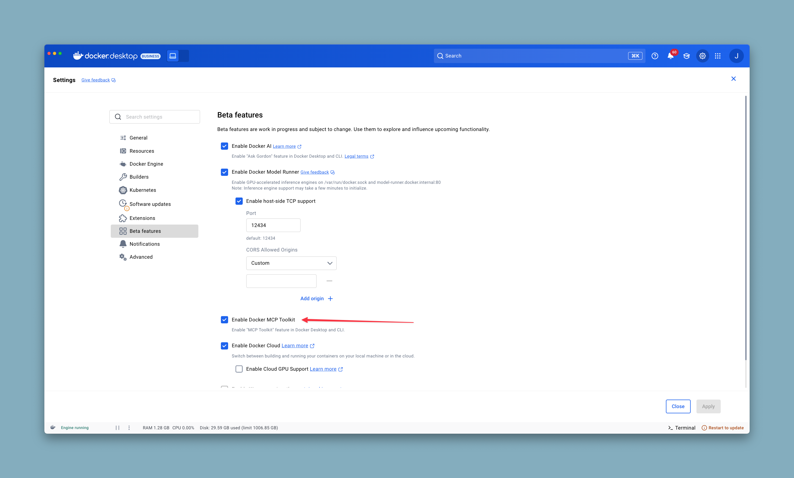

# Docker MCP Gateway


The Docker MCP gateway allows developers to consume MCP servers from the [Docker MCP Catalog](https://hub.docker.com/mcp). Using the [MCP Toolkit](https://docs.docker.com/ai/mcp-catalog-and-toolkit/toolkit/), developers can package and distribute their own Model Context Protocol servers.

## What is MCP?

The [Model Context Protocol (MCP)](https://spec.modelcontextprotocol.io/) is an open protocol that standardizes how AI applications connect to external data sources and tools. It provides a secure, controlled way for language models to access and interact with various services, databases, and APIs.

## Overview

Developers face criticial barriers when integrating Model Context Protocol (MCP) tools into production workflows:

- **Managing MCP server lifecycle** Each local MCP sever in the catalog runs in an isolated Docker container. npx and uvx servers can be granted minimal host privileges.
- **Providing a unified interface** AI models access MCP servers through a single gateway AI gateway.
- **Handling authentication and security** Keep secrets out of environment variables using Docker Desktop's secrets management
- **Supports dynamic tool discovery** and configuration. Each MCP client (eg VS Code, Cursor, Claude Desktop, etc.) connects to the same gateway configuration, ensuring consistency across different clients.
- **Enables OAuth flows** for MCPs that require OAuth access token service connections

## Features

- 🔧 **Server Management**: List, inspect, and call MCP tools, resoures and prompts from multiple servers
- 🐳 **Container-based Servers**: Run MCP servers as Docker containers with proper isolation
- 🔐 **Secrets Management**: Secure handling of API keys and credentials via Docker Desktop
- 🌐 **OAuth Integration**: Built-in OAuth flows for service authentication
- 📋 **Server Catalog**: Manage and configure multiple MCP catalogs
- 🔍 **Dynamic Discovery**: Automatic tool, prompt, and resource discovery from running servers
- 📊 **Monitoring**: Built-in logging and call tracing capabilities

## Installation

### Prerequisites

- Docker Desktop (with MCP Toolkit feature enabled)

<div align="left">
  
</div>
- Go 1.24+ (for development)

### Install as Docker CLI Plugin

The MCP cli will already be installed on recent versions of Docker Desktop but you can update to the latest version by following these steps.

```bash
# Clone the repository
git clone https://github.com/docker/docker-mcp.git
cd docker-mcp

# Build and install the plugin
make docker-mcp
```

After installation, the plugin will be available as:

```bash
docker mcp --help
```

## Usage

### Catalog Management

Manage the catalogs available to the MCP gateway. The [default catalog](https://hub.docker.com/mcp) is available with the name 'docker-mcp'.

```bash
# Manage server catalogs
docker mcp catalog --help

# list available catalogs
docker mcp catalog ls

# show all servers in a catalog
docker mcp catalog show docker-mcp
```

### Server Management

Enable and disable the set of MCP servers that will be available for default clients. The MCP gateway can be configured to expose different sets of servers and tools but enabling and disabling servers here impacts the default gateway configuration.

```bash
# List enabled servers
docker mcp server list

# Enable one or more servers
docker mcp server enable <server-name> [server-name...]

# Disable servers
docker mcp server disable <server-name> [server-name...]

# Get detailed information about a server
docker mcp server inspect <server-name>

# Reset (disable all servers)
docker mcp server reset
```

### Configuration Management

Configure any MCP servers that require custom runtime configuration.

```bash
# Read current configuration
docker mcp config read

# Write new configuration
docker mcp config write '<yaml-config>'

# Reset configuration to defaults
docker mcp config reset
```

### Secrets and OAuth

Configure MCP servers that require either secrets or OAuth.

```bash
# Manage secrets
docker mcp secret --help

# Handle OAuth flows
docker mcp oauth --help

# Manage access policies
docker mcp policy --help

# export any desktop secrets needed by either server1 or server2
#   (temporary requirement to export secrets for docker cloud runs - this command
#    will no longer be required once Docker Cloud can access secret stores) 
docker mcp secret export server1 server2
```

### Gateway Operations

Start up an MCP gateway. This can be used for one client, or to service multiple clients if using either `sse` or `streaming` transports.

```bash
# Run the MCP gateway (stdio)
docker mcp gateway run

# Run the MCP gateway (streaming)
docker mcp gateway run --port 8080 --transport streaming

# Run with specific servers only, and select all tools from server1 and just tool2 from server2
docker mcp gateway run --servers server1 --servers server2 --tools server1:* --tools server2:tool2

# Run a fallback secret lookup - lookup desktop secret first and the fallback to a local .env file
docker mcp gateway run --secrets=docker-desktop:./.env

# Run with verbose logging
docker mcp gateway run --verbose --log-calls

# Run in watch mode (auto-reload on config changes)
docker mcp gateway run --watch
```

### Tool Management

```bash
# Show available commands
docker mcp --help

# List all available MCP tools
docker mcp tools list

# Inspect a specific tool
docker mcp tools inspect <tool-name>

# Call a tool with arguments
docker mcp tools call <tool-name> [arguments...]

# Count available tools
docker mcp tools count
```

## Configuration

The MCP CLI uses several configuration files:

- **`docker-mcp.yaml`**: Server catalog defining available MCP servers
- **`registry.yaml`**: Registry of enabled servers
- **`config.yaml`**: Gateway configuration and options

Configuration files are typically stored in `~/.docker/mcp/`.

## Development

### Building from Source

```bash
# Build the binary
make docker-mcp

# Cross-compile for all platforms
make docker-mcp-cross

# Run tests
make test
```

### Code Quality

```bash
# Format code
make format

# Run linter
make lint
```

## Architecture

The Docker MCP CLI implements a gateway pattern:

```
AI Client → MCP Gateway → MCP Servers (Docker Containers)
```

- **AI Client**: Language model or AI application
- **MCP Gateway**: This CLI tool managing protocol translation and routing
- **MCP Servers**: Individual MCP servers running in Docker containers

See [docs/message-flow.md](docs/message-flow.md) for detailed message flow diagrams.

## Contributing

1. Fork the repository
2. Create a feature branch (`git checkout -b feature/amazing-feature`)
3. Make your changes
4. Run tests and linting (`make unit-tests lint`)
5. Commit your changes (`git commit -m 'Add amazing feature'`)
6. Push to the branch (`git push origin feature/amazing-feature`)
7. Open a Pull Request

## License

This project is licensed under the MIT License - see the [LICENSE](LICENSE) file for details.

## Code of Conduct

This project follows a Code of Conduct. Please review it in [CODE_OF_CONDUCT.md](CODE_OF_CONDUCT.md).

## Support

- 📖 [MCP Specification](https://spec.modelcontextprotocol.io/)
- 🐳 [Docker Desktop Documentation](https://docs.docker.com/desktop/)
- 🐛 [Report Issues](https://github.com/docker/docker-mcp/issues)
- 💬 [Discussions](https://github.com/docker/docker-mcp/discussions)
