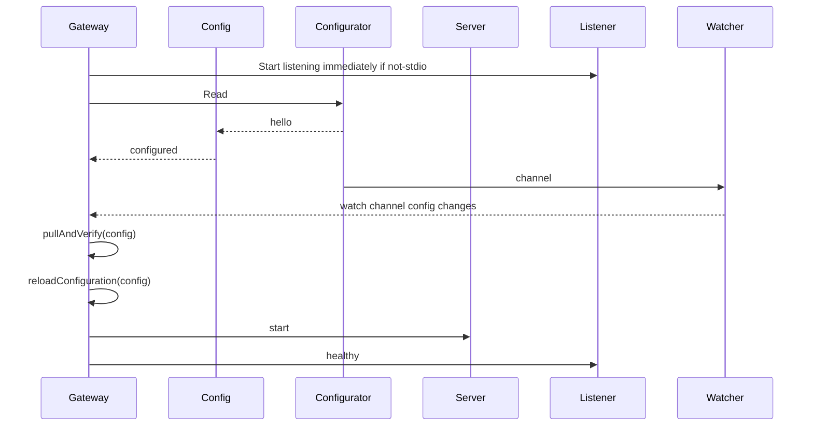
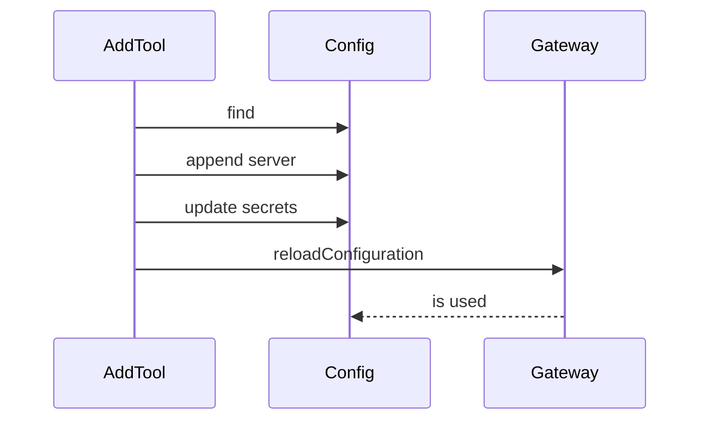

# Gateway startup



## Reading Config

The `Read` method in `Configurator` is responsible for building an initial `Configuration`

* serverNames
* catalog.Servers (this is our catalog)
    * read from catalog.yaml files
    * read from oci artifacts
* config map
* tool filters
* secret providers
    * DD
    * file

## reloadConfiguration

The gateway `reloadConfiguration` extracts capabilities from the current configuration, and updates the Server. It starts up the server to do this.

When running servers raise change notifications, the capabilities also have to be reloaded.

# Dynamic Server Add

Another place where the capabilities should be considered _dynamic_ is with the `mcp-server-add` tool. This tool loads new mcp servers into a gateway session.



During `reloadConfiguration` all updates to capabilities will cause change events to be sent to any clients connected to this server.

# Images without Catalogs

A Docker Image can contain it's own catalog description. If this is the case case the server oci reference is sufficient to populate the catalog.  In this case, `docker mcp gateway run --server docker.io/namespace/image:latest` will be sufficient to bootstrap the gateway. The requirement on this server is that it has a label like the following:

```
LABEL io.docker.server.metadata="{... server metadata ...}"
```

When the Configuration is first read, server names that are hub oci references will pulled, the label will be extracted, and we'll update both the list of serverNames, and the set of servers.


