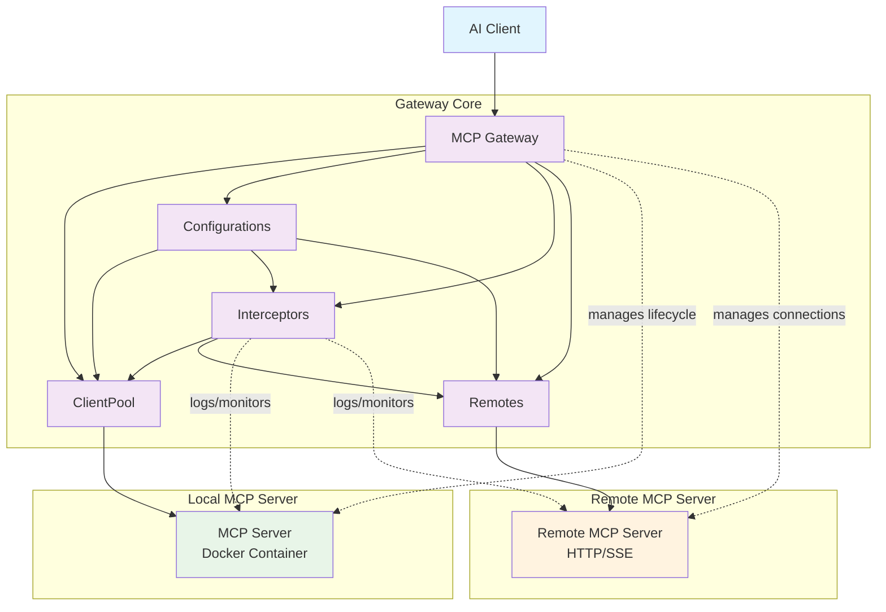

# Official Registry Integration

## Architecture Overview

This diagram shows the interactions between the core components of the MCP Gateway system:

## Component Interactions

### Gateway
- Central orchestrator that receives requests from AI clients
- Manages the lifecycle of MCP servers running in Docker containers
- Routes messages between clients and appropriate servers

### ClientPool
- Manages connections to multiple MCP servers
- Handles connection pooling and load balancing
- Maintains persistent connections to containerized servers

### Configurations
- Provides configuration data to ClientPool and Interceptors
- Manages server definitions, transport modes, and security settings
- Loads from catalog files and runtime configuration

### Interceptors
- Intercept and monitor communication between clients and servers
- Handle logging, security validation, and call inspection
- Can modify or block requests based on policies

### Remotes
- Manages connections to remote MCP servers via HTTP/SSE
- Handles authentication and custom headers for remote endpoints
- Provides unified interface for both local and remote MCP servers
- Supports load balancing across multiple remote instances

### MCP Servers
- Run as isolated Docker containers
- Each server provides specific tools and capabilities
- Communicate with the gateway via stdio, SSE, or streaming protocols

### Remote MCP Servers
- External MCP servers accessible via HTTP/SSE protocols
- Can be hosted anywhere with network connectivity
- Support custom authentication and header configurations
- Integrated seamlessly alongside containerized servers
