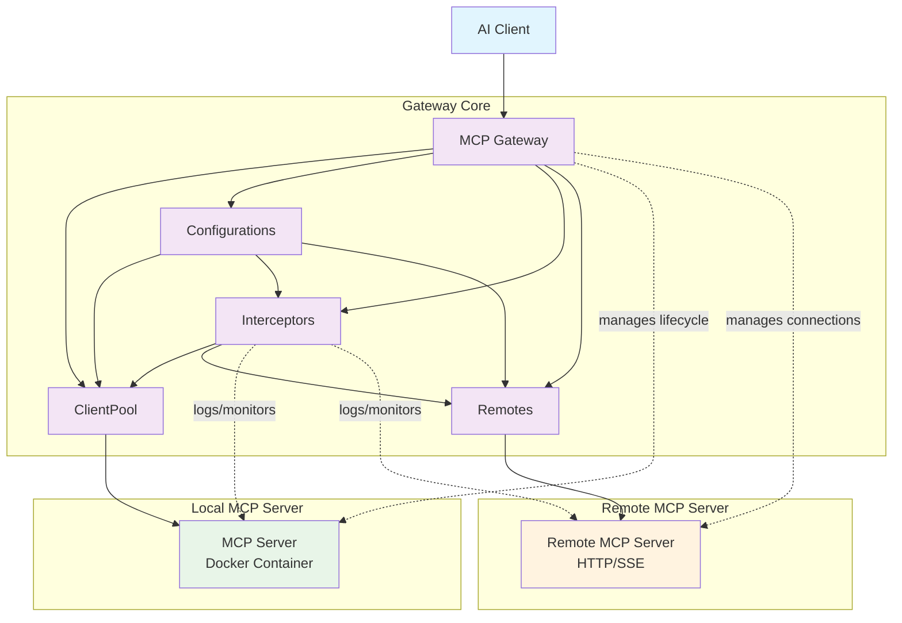

# Official Registry Integration

## Architecture Overview

This diagram shows the interactions between the core components of the MCP Gateway system:



## Component Interactions

### Gateway
- Central orchestrator that receives requests from AI clients
- Manages the lifecycle of MCP servers running in Docker containers
- Routes messages between clients and appropriate servers

### ClientPool
- Manages connections to multiple MCP servers
- Handles connection pooling and load balancing
- Maintains persistent connections to containerized servers

### Configurations
- Provides configuration data to ClientPool and Interceptors
- Manages server definitions, transport modes, and security settings
- Loads from catalog files and runtime configuration

### Interceptors
- Intercept and monitor communication between clients and servers
- Handle logging, security validation, and call inspection
- Can modify or block requests based on policies

### Remotes
- Manages connections to remote MCP servers via HTTP/SSE
- Handles authentication and custom headers for remote endpoints
- Provides unified interface for both local and remote MCP servers
- Supports load balancing across multiple remote instances

### MCP Servers
- Run as isolated Docker containers
- Each server provides specific tools and capabilities
- Communicate with the gateway via stdio, SSE, or streaming protocols

### Remote MCP Servers
- External MCP servers accessible via HTTP/SSE protocols
- Can be hosted anywhere with network connectivity
- Support custom authentication and header configurations
- Integrated seamlessly alongside containerized servers

# Importing Servers from the Official Registry

The official registry provides data that can now be imported into a gateway `Configuration`. Previously the entire Configuration was read from files (`FileBasedConfiguration`), but as part of this work, we are also supporting pulling catalogs from oci artifacts. A catalog in an oci artifact becomes just another source of servers for a Gateway `Configuration`. The Configuration Object itself is unchanged. We are providing new ways to populate it. The current gateway Configuration is a set of available servers, and their config.

* **Configuration.servers** - map of available `catalog.Server`s
* **Configuration.config** - current configuration map

Since the ways to import servers is increasing, we have started by providing a command to import an Official MCP registry server into an OCI artifact.


```bash
docker mcp server import \
                  http://registry.modelcontextprotocol.io/v0/servers/50f96447-f833-4bc0-bb47-645c99caa27d \
                  jimclark106/mcpservers \
                  --push=true
```

This will give us an oci artifact reference for our server ( `index.docker.io/jimclark106/mcpservers@sha256:84e31bb356a80731f97cad0addcd53c649bc2f42916854a74884616f90376124`). If you import the same server, you will always get the same digest. this reference can be used to create new working sets out or just passed directly to a gateway for testing.

```
docker mcp gateway run --oci-ref index.docker.io/jimclark106/mcpservers@sha256:84e31bb356a80731f97cad0addcd53c649bc2f42916854a74884616f90376124
```

These two steps can be combined.

```
docker mcp gateway run --oci-ref $(docker mcp server import http://registry.modelcontextprotocol.io/v0/servers/50f96447-f833-4bc0-bb47-645c99caa27d)
```

We think this is probably only useful during testing because gateway will most often see this content as part of larger catalogs that have been created for particular use cases.
