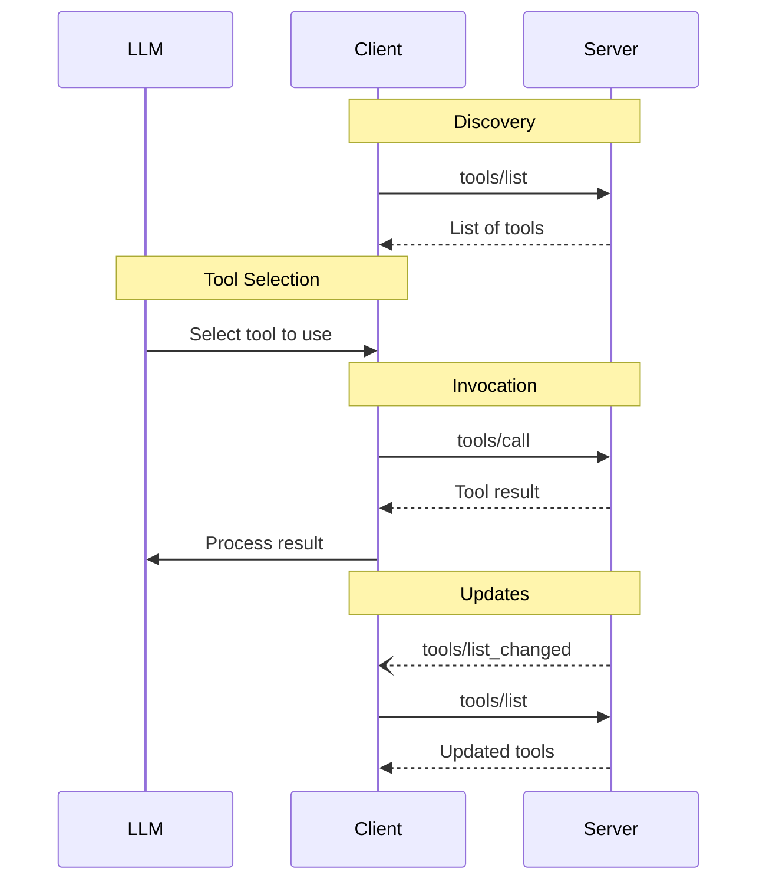
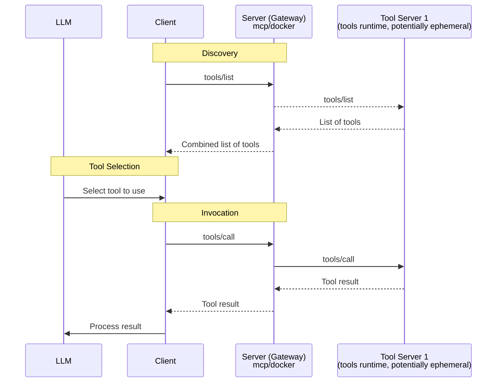

## Message Flow
Src: [official docs page](https://spec.modelcontextprotocol.io/specification/2025-03-26/server/tools/#message-flow)

```mermaid
sequenceDiagram
    participant LLM
    participant Client
    participant Server

    Note over Client,Server: Discovery
    Client->>Server: tools/list
    Server-->>Client: List of tools

    Note over Client,LLM: Tool Selection
    LLM->>Client: Select tool to use

    Note over Client,Server: Invocation
    Client->>Server: tools/call
    Server-->>Client: Tool result
    Client->>LLM: Process result

    Note over Client,Server: Updates
    Server--)Client: tools/list_changed
    Client->>Server: tools/list
    Server-->>Client: Updated tools
```

Docker Model

```mermaid
sequenceDiagram
    participant LLM
    participant Client
    participant Server as Server (Gateway)<br/>mcp/docker
    participant ToolServer as Tool Server 1<br/>(tools runtime, potentially ephemeral)

    Note over Client,Server: Discovery
    Client->>Server: tools/list
    Server-->>ToolServer: tools/list
    ToolServer-->>Server: List of tools
    Server-->>Client: Combined list of tools

    Note over Client,LLM: Tool Selection
    LLM->>Client: Select tool to use

    Note over Client,Server: Invocation
    Client->>Server: tools/call
    Server->>ToolServer: tools/call
    ToolServer-->>Server: Tool result
    Server-->>Client: Tool result
    Client->>LLM: Process result

%%    Note over Client,Server: Updates
%%    Server--)Client: tools/list_changed
%%    Client->>Server: tools/list
%%    Server-->>Client: Updated tools
```