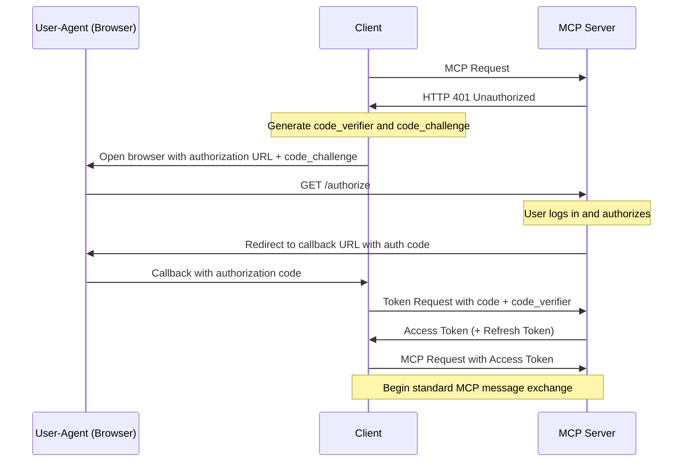
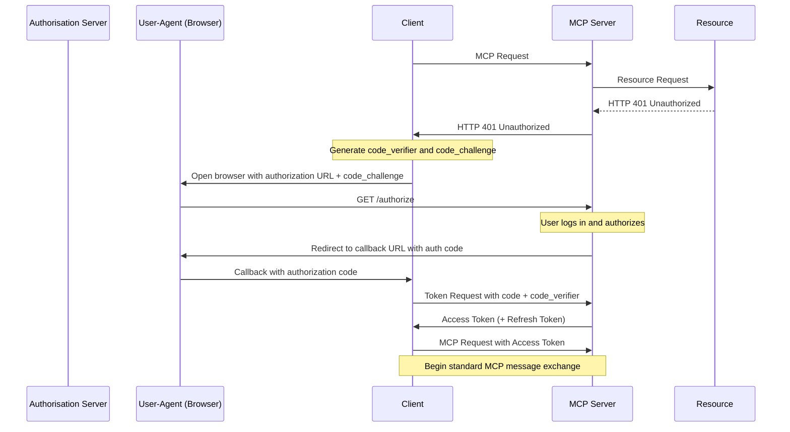
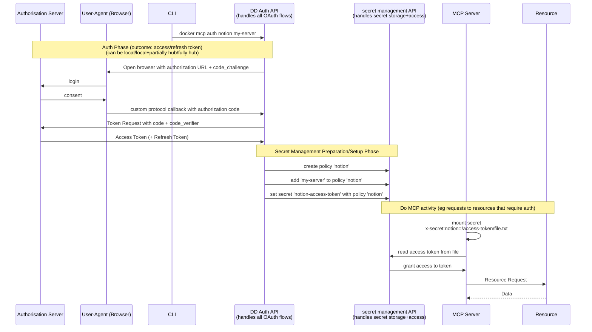
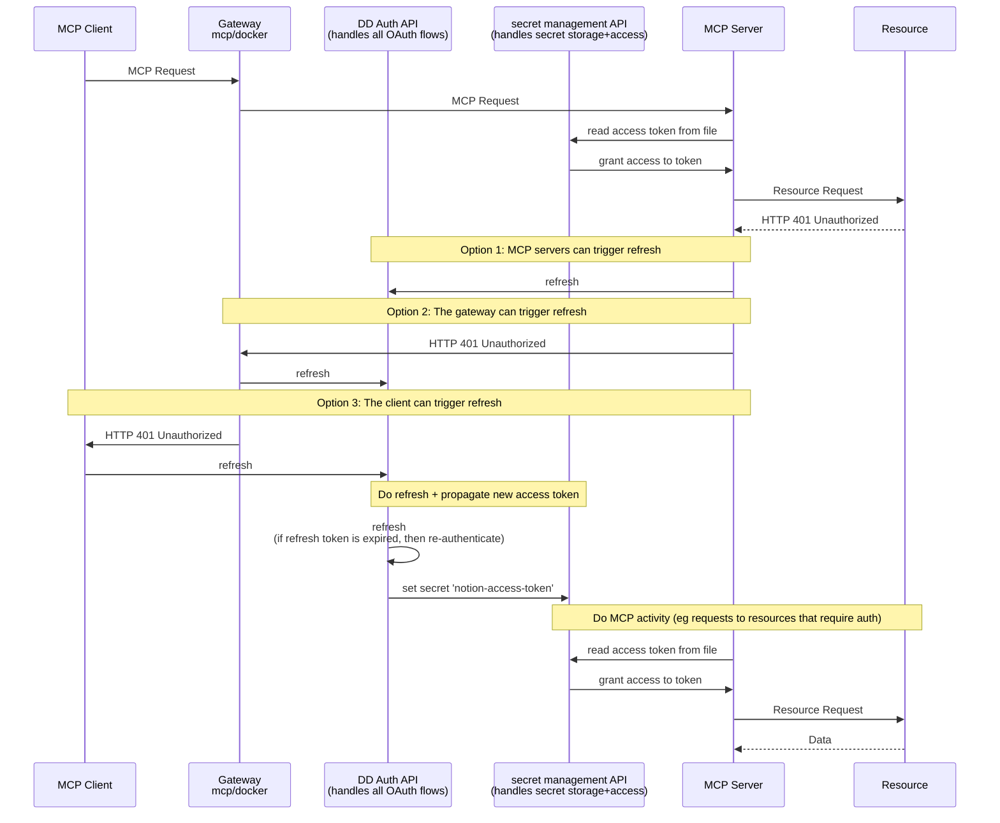
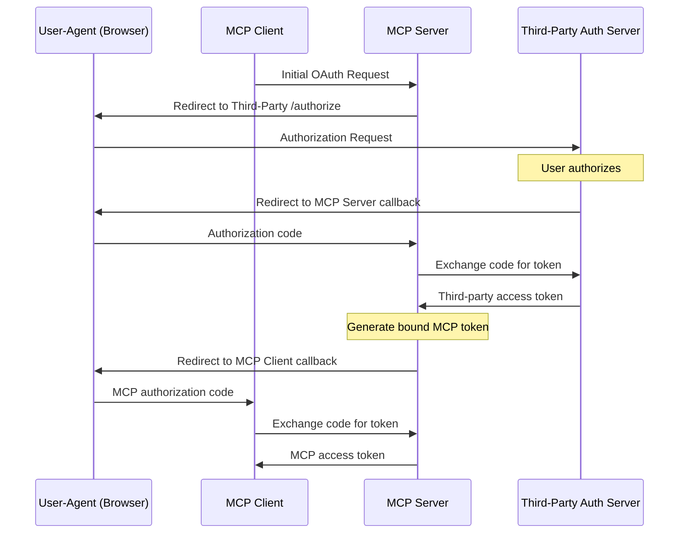
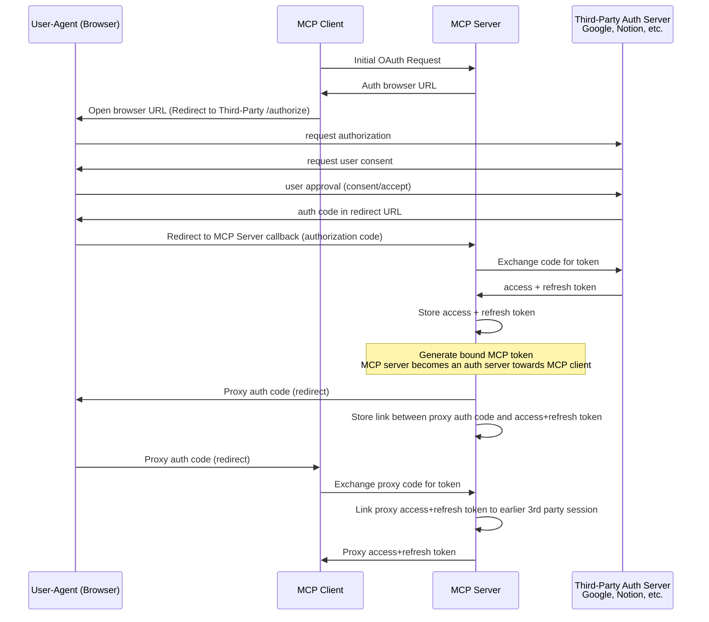

# OAuth Flows Comparison

### 2.2 Basic OAuth 2.1 Authorization

When authorization is required and not yet proven by the client, servers **MUST** respond
with _HTTP 401 Unauthorized_.

Clients initiate the
[OAuth 2.1 IETF DRAFT](https://datatracker.ietf.org/doc/html/draft-ietf-oauth-v2-1-12)
authorization flow after receiving the _HTTP 401 Unauthorized_.

The following demonstrates the basic OAuth 2.1 for public clients using PKCE.

## Official MCP OAuth diagram mapped

### Questions

## Docker MCP OAuth Model
Key points:
- We implement the OAuth flows, nobody else has to.
- Via a developer portal, 3rd parties can add OAuth clients (config with client_id, client_secret, redirect_uri).
- We provide a secure and easy way to store and access secrets.

### Pre-authorization (`docker mcp auth notion my-server`)

### Handling 401 Unauthorized
Note: Option 2 is the most elegant and safest solution. Neither the MCP server nor the MCP client need to know about all the details of the OAuth flow.

### Notes and observations
Docker has some advantages:
- We are already running in the background all the time.
- This allows us to handle secret storage and management seamlessly in the background on the user's machine instead of on our infrastructure.
- We don't need to be an OAuth server to register dynamic clients. 
  The client can use the credentials stored by DD, since we are in a trusted environment (on the user's machine).
  We just need to be a good proxy.
- Usually clients have the problem of not being trusted.
  We also have an advantage here as we can use the Docker Desktop login to provide a secure environment for clients.

#### 2.9.2 Flow Description

[src](https://spec.modelcontextprotocol.io/specification/2025-03-26/basic/authorization/#292-flow-description)

The third-party authorization flow comprises these steps:

1. MCP client initiates standard OAuth flow with MCP server
2. MCP server redirects user to third-party authorization server
3. User authorizes with third-party server
4. Third-party server redirects back to MCP server with authorization code
5. MCP server exchanges code for third-party access token
6. MCP server generates its own access token bound to the third-party session
7. MCP server completes original OAuth flow with MCP client

Questions:
- Alano: The diagram implies that the MCP server runs remotely. Is that correct? Because why otherwise would you need the MCP client to be authorized?

#### All details included

